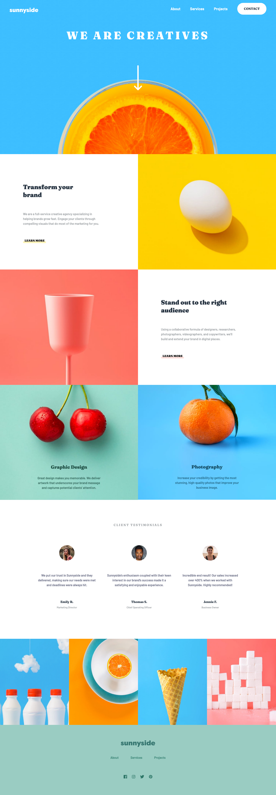
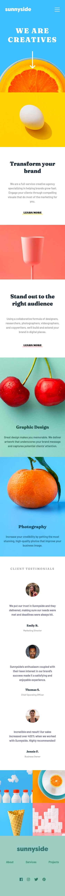

# Frontend Mentor - Sunnyside agency landing page solution

This is a solution to the [Sunnyside agency landing page challenge on Frontend Mentor](https://www.frontendmentor.io/challenges/sunnyside-agency-landing-page-7yVs3B6ef).

## Table of contents

- [Overview](#overview)
  - [The challenge](#the-challenge)
  - [Screenshot](#screenshot)
- [My process](#my-process)
  - [Built with](#built-with)
  - [What I learned](#what-i-learned)
  - [Useful resources](#useful-resources)
- [Author](#author)

## Overview

### The challenge

Users should be able to:

- View the optimal layout for the site depending on their device's screen size
- See hover states for all interactive elements on the page

### Screenshot

#### Desktop solution


#### Mobile solution


## My process

### Built with

- Semantic HTML5 markup
- CSS custom properties
- Flexbox
- JS
- Mobile-first workflow

### What I learned

- [To make sure that a background image covers entirely the background even when this one is resized:]()

```css
header {
    background-image: url(images/mobile/image-header.jpg);
    background-size: 100% 100%;
    height: 55vh;
}
```

- [To create a dropdown menu with a triangle-shaped protrusion:]()

```html
<div id="dropdown-menu">
      <div id="triangle"></div>
      <div id="dropdown-content">
        <a class="grey-items" href="#">About</a>
        <a class="grey-items" href="#">Services</a>
        <a class="grey-items" href="#">Projects</a>
        <a class="yellow-item" href="#">Contact</a>
      </div>
    </div>
```
```css
#dropdown-menu {
    display: none;
    position: absolute;
    top: 100px;
    width: 100%;
}

#triangle {
    width: 0;
	height: 0;
	border-top: 25px solid transparent;
	border-right: 25px solid white;
    position: absolute;
    right: 28px;
    z-index: 1;
}

#dropdown-content {
    display: flex;
    flex-direction: column;
    margin: 6% 7.5% 0 7.5%;
    align-items: center;
    justify-content: space-evenly;

    width: 85%;
    height: 320px;
    background-color: white;
    z-index: 1;
}
```
- [To make a round underlining behind the text:]()

```html
<div class="button-section" id="transform-button">
  Learn more
</div>
```

```css
.button-section {
    border-radius: 10px;
    height: 10px;
    width: fit-content;
    padding: 0 8px;

    text-transform: uppercase;
    font-weight: 900;
    font-size: 0.9rem;

    cursor: pointer;
}

#transform-button {
    box-shadow: 0 13px 0 0 rgba(250, 212, 0, 0.277);
}

#transform-button:hover {
    box-shadow: 0 13px 0 0 rgba(250, 212, 0, 0.998);
}
```

- [To trasform a white image into a colorful one:]()

```html
<div id="logo-container">
  
</div>
```

```css
#logo-container img {
    filter: invert(49%) sepia(26%) saturate(641%) hue-rotate(118deg) brightness(74%) contrast(92%);
    width: 180px;
}
```

### Useful resources

- [Color filter generator for images](https://codepen.io/sosuke/pen/Pjoqqp) - This enabled me to change the color of the white logo applying a filter on it.
- [How to change icon color to white or black](https://blog.yipl.com.np/black-and-white-version-of-colored-icons-with-css-f3422dc79e13) - This article explains how to change the color of an icon to white or black with the property:

```css
filter: brightness(0);
filter: brightness(100)
```

## Author

- GitHub - [martinavaira](https://github.com/martinavaira)
- Frontend Mentor - [@martinavaira](https://www.frontendmentor.io/profile/martinavaira)


